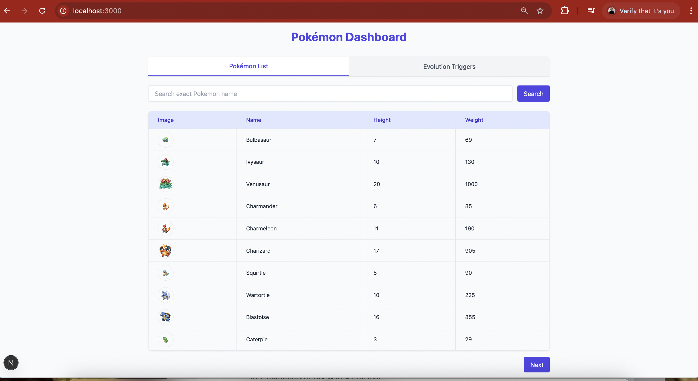

# Pokémon Table App 🧬

A sleek and responsive web application built with **Next.js** and **Tailwind CSS** that displays a searchable and paginated list of Pokémon and Evolution Triggers using the [PokéAPI](https://pokeapi.co/).

## ✨ Features

- Pokémon Table with:
  - Search by exact name
  - Pagination (Next/Previous)
  - Detail Modal with stats
- Evolution Triggers Table:
  - Separate paginated table
- Tab view to switch between Pokémon List and Evolution Triggers
- Loading spinner on navigation

---

## ⚙️ Tech Stack

- [Next.js](https://nextjs.org/)
- [React](https://react.dev/)
- [Tailwind CSS](https://tailwindcss.com/)
- [Framer Motion](https://www.framer.com/motion/) (for tab animation)
- [PokéAPI](https://pokeapi.co/) (external data source)

---

## Preview



## 🚀 Getting Started

### 1. Clone the repository

```bash
git clone https://github.com/sahebghosh/pokemon-table-app.git
cd pokemon-table-app
npm install
npm run dev
App runs at: http://localhost:3000


```
